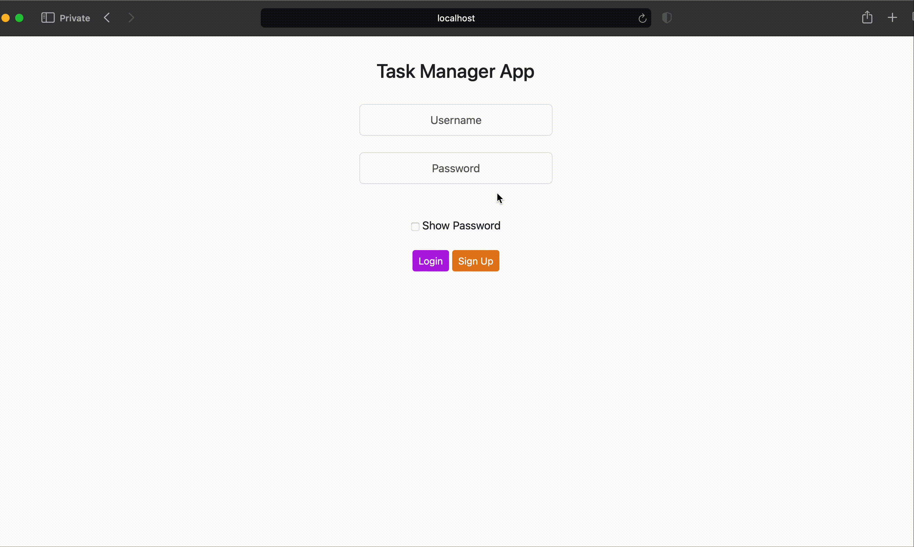
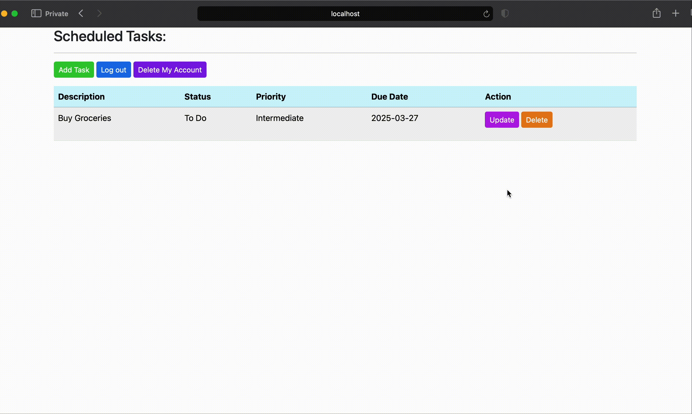
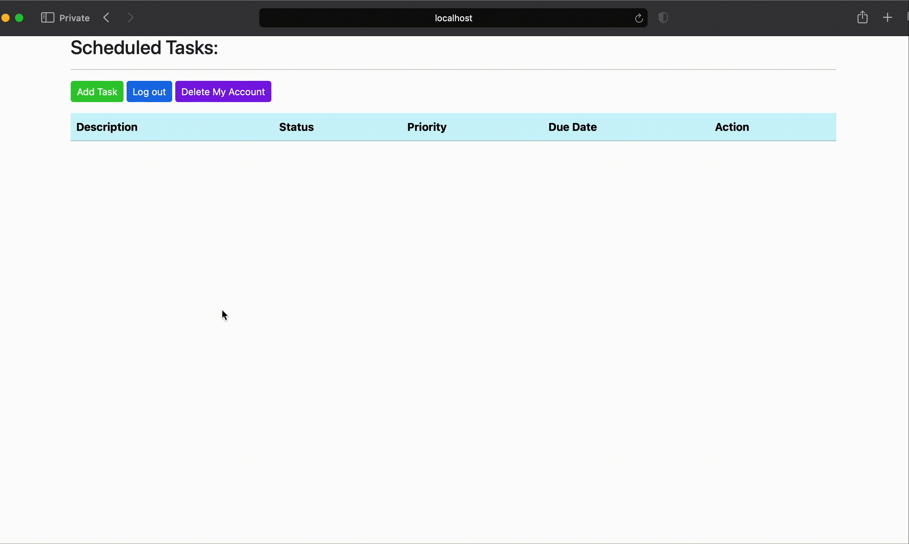
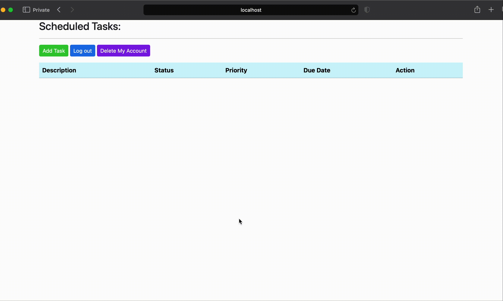

# **Task Manager App**

A simple and secure task management web application built with **Java**, **Spring Boot**, **Thymeleaf** and **MySQL**. Users can register, log in, create and manage tasks and delete their accounts. Admins can view and manage non-admin users.

## **Features**

- User registration and login
- Role-based access control (Admin/User)
- Add, update and delete tasks
- Secure password hashing using BCrypt
- Spring Security authentication and authorization
- Clean UI with Thymeleaf templates and CSS Bootstrap
- Test coverate (Controllers, Services, Security)

## **Technologies Used**

- Java 23
- Spring Boot 3.4
- Spring Security
- Spring Data JPA
- Thymeleaf
- MySQL
- JUnit / Mockito
- Maven

## **App Features and Demos**

1. Create a New User

2. Log in

3. Add a Task

4. Update a Task

5. Delete A Task

6. Log Out

7. Delete Account

8. Admin User Management
  

## **Setup Instructions**

1. Clone the repository

   git clone https://github.com/ChestnutDots/Task_Manager.git
   cd task-manager-app

2. Configure your database
   - create a MySQL database named "task-directory" (you can use the schema.sql file in the sql_scripts folder)
   - update the application.properties fiel with your DB credentials

3. Configure the application.properties file
   - rename the sample-application.properties to application.properties
   - add your own database login information

4. Run the app
   - with IntelliJ: Run the TaskManagerApplication.java file
   - or use ./mvnw spring-boot:run
  
5. Access the app
   - http://localhost:8080/
  
6. Run tests
   - ./mvnw test
  
## **Folder Structure**

<pre>
   src/
├── main/
│   ├── java/
│   │   └── com/TaskManager/TaskManager/
│   │       ├── controller/
│   │       ├── dao/
│   │       ├── entity/
│   │       ├── security/
│   │       └── service/
│   └── resources/
│       ├── templates/
│       └── application.properties
└── test/

</pre>

## **Admin Access**

You can add admin roles manually to a user in the "roles" table (simply add ROLE_ADMIN).

## **License**

This project is licensed under the MIT License.

## **Author**

Linda Bistere

